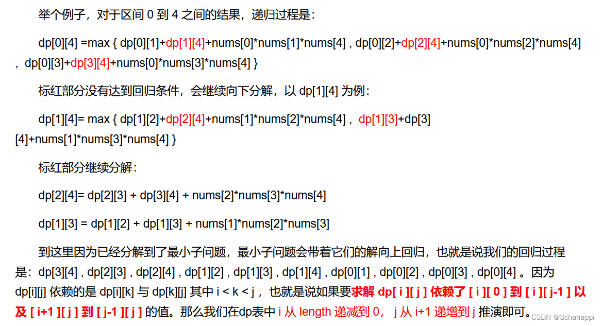

<!-- @format -->

## 买卖股票的最佳时机含冷冻期 && 戳气球

两道动态规划题

- [买卖股票的最佳时机含冷冻期 \&\& 戳气球](#买卖股票的最佳时机含冷冻期--戳气球)
  - [买卖股票的最佳时机含冷冻期](#买卖股票的最佳时机含冷冻期)
    - [题目详情](#题目详情)
    - [解题思路](#解题思路)
    - [代码实现](#代码实现)
  - [戳气球](#戳气球) - [题目详情](#题目详情-1) - [解题思路](#解题思路-1) - [代码实现](#代码实现-1)
  <!--more-->

### 买卖股票的最佳时机含冷冻期

#### 题目详情

给定一个整数数组 prices，其中第 prices[i] 表示第 i 天的股票价格 。​

设计一个算法计算出最大利润。在满足以下约束条件下，你可以尽可能地完成更多的交易（多次买卖一支股票）:

卖出股票后，你无法在第二天买入股票 (即冷冻期为 1 天)。
注意：你不能同时参与多笔交易（你必须在再次购买前出售掉之前的股票）。

#### 解题思路

和前面的买卖股票相似，每天的股票存在三个状态：

1. 手上不持有股票且不在冷冻期
2. 手上持有股票
3. 手上不持有股票且在冷冻期

这样只要最后返回出 1 3 两种状态的最大值即可

#### 代码实现

```TS
function maxProfit(prices: number[]): number {
  const n = prices.length;
  if (n == 0) return 0;
  const dp: number[][] = new Array(n).fill(0).map(() => new Array(3).fill(0));
  dp[0][1] = -prices[0];
  for (let i = 1; i < n; i++) {
    // 状态0：手上不持有股票且不在冷冻期，可能是昨天就不持有，或者是今天卖出了股票
    dp[i][0] = Math.max(dp[i - 1][0], dp[i - 1][2]);
    // 状态1：手上持有股票，可能是昨天就持有，或者是今天买入的
    dp[i][1] = Math.max(dp[i - 1][1], dp[i - 1][0] - prices[i]);
    // 状态2：手上不持有股票且在冷冻期，只可能是昨天卖出了股票
    dp[i][2] = dp[i - 1][1] + prices[i];
  }
  return Math.max(dp[n - 1][0], dp[n - 1][2]);
}
```

### 戳气球

#### 题目详情

有 n 个气球，编号为 0 到 n - 1，每个气球上都标有一个数字，这些数字存在数组 nums 中。

现在要求你戳破所有的气球。戳破第 i 个气球，你可以获得 nums[i - 1] _ nums[i] _ nums[i + 1] 枚硬币。 这里的 i - 1 和 i + 1 代表和 i 相邻的两个气球的序号。如果 i - 1 或 i + 1 超出了数组的边界，那么就当它是一个数字为 1 的气球。

求所能获得硬币的最大数量。

#### 解题思路

戳破一个气球后，剩下的气球并不会因此改变相对位置，所以我们可以假设最后一个戳破的气球是 i，那么问题就转化为:  
**求解 "将气球 i 之前的气球全部戳破，并且将气球 i 之后的气球全部戳破，然后戳破气球 i，所能获得的最大硬币数"**  
因此，状态转移方程为：  
`dp[i][j][k] = max(dp[i][j][k], dp[i][m-1][k] + value[i-1]*value[m]*value[k+1] + dp[m+1][j][k]) (i <= m <= j)`  
顺便看到的一个大佬的解题思路：


#### 代码实现

```TS
function maxCoins(nums: number[]): number {
  const dp: number[][] = new Array(nums.length + 2).fill(0).map(() => new Array(nums.length + 2).fill(0));
  const n = nums.length;
  const val = new Array(n + 2).fill(0);
  val[0] = val[n + 1] = 1;
  for (let i = 1; i <= n; i++) {
    val[i] = nums[i - 1];
  }

  // len 是子问题的规模，从3开始，因为至少需要两个边界气球和一个真实的气球
  for (let len = 3; len <= n + 2; len++) {
    // i 是子问题的左边界
    for (let i = 0; i <= n + 2 - len; i++) {
      // j 是子问题的右边界，可以通过左边界 i 和子问题的规模 len 计算得到
      let j = i + len - 1;
      // k 是在 (i, j) 区间内的气球，我们假设 k 是最后一个被戳破的气球
      for (let k = i + 1; k < j; k++) {
        // dp[i][j] 表示戳破区间 (i, j) 内所有气球能得到的最大分数
        // 我们遍历所有可能的 k，并更新 dp[i][j] 的值
        // dp[i][k] + dp[k][j] 是戳破两个子区间的最大分数
        // val[i] * val[k] * val[j] 是最后戳破气球 k 能得到的分数
        dp[i][j] = Math.max(dp[i][j], dp[i][k] + dp[k][j] + val[i] * val[k] * val[j]);
      }
    }
  }

  return dp[0][n + 1];
```
